# 🌐 Реестр источников данных и площадок для парсинга (Data Sources Registry) — Одесса

В этом документе зафиксирован официальный перечень внешних площадок, маркетплейсов и каналов для агрегации объявлений в проект **IntentMarket («Мой OLX»)**, начиная с одесского региона.

---

## 1. Стратегия агрегации по фазам

```mermaid
flowchart LR
    subgraph Phase1["Фаза 1: Базовая ликвидность (Активна)"]
        OLX["OLX.ua (Генераторы, Квартиры)"]
        DOMRIA["DOM.ria (Аренда квартир Одесса)"]
        RABOTNIKI["Работники UA (Электрики, Мастера)"]
        PROM["Prom.ua (Одесские склады / 7 км)"]
    end

    subgraph Phase2["Фаза 2: Бытовые услуги и авто"]
        KABANCHIK["Kabanchik.ua (Услуги Одесса)"]
        AUTORIA["AUTO.ria (Авто Одесская обл.)"]
        ROZETKA["Rozetka Marketplace (Цены-бенчмарки)"]
    end

    subgraph Phase3["Фаза 3: Прямой P2P & Чаты"]
        TG["Одесские Telegram барахолки и чаты ЖК"]
        LUN["LUN / Flatfy (Новостройки и ЖК Одессы)"]
        RIELTOR["Rieltor.ua (Эксклюзивы Одессы)"]
    end

    Phase1 --> Phase2 --> Phase3
```

---

## 2. Детальный реестр площадок

### Категория 1: Силовая техника, генераторы и электроника
| Площадка | Идентификатор источника | URL / Регион | Целевые категории | Метод сбора данных | Частота обновления |
| :--- | :--- | :--- | :--- | :--- | :--- |
| **OLX.ua** | `e0000000-0000-0000-0000-000000000001` | `olx.ua/odessa/` | Генераторы (инверторные, бензиновые, дизельные), зарядные станции (EcoFlow, Bluetti), аккумуляторы | HTTP API / Sitemaps / Селекторы карточек | Каждые 6 часов |
| **Prom.ua** | `e0000000-0000-0000-0000-000000000002` | `prom.ua/odesa` | Новые генераторы со складов Одессы («7 км», оптово-розничные базы), кабели, АВР | Публичный каталог / RSS-ленты | Каждые 12 часов |
| **Rozetka** | `e0000000-0000-0000-0000-000000000005` | `rozetka.com.ua` | Электроника, бенчмарк розничных цен | Парсинг публичных карточек товаров | Раз в сутки |

---

### Категория 2: Недвижимость (Долгосрочная и посуточная аренда квартир в Одессе)
| Площадка | Идентификатор источника | URL / Регион | Целевые категории | Метод сбора данных | Частота обновления |
| :--- | :--- | :--- | :--- | :--- | :--- |
| **DOM.ria** | `e0000000-0000-0000-0000-000000000003` | `dom.ria.com/odessa/` | Проверенная аренда квартир (1к, 2к, 3к, студии) по районам: Аркадия, Таирова, Центр, Фонтан | Публичные ленты / API DOM.ria | Каждые 6 часов |
| **OLX Недвижимость** | `e0000000-0000-0000-0000-000000000001` | `olx.ua/nedvizhimost/odessa/` | Частная аренда и предложения риелторов в Одессе | Модуль `olx_adapter.py` | Каждые 4 часа |
| **LUN.ua / Flatfy** | `e0000000-0000-0000-0000-000000000006` | `lun.ua/odessa` | Каталог ЖК (Kadorr, Будова, Стикон) для дедупликации адресов | Реестр комплексов | Раз в неделю |
| **Rieltor.ua** | `e0000000-0000-0000-0000-000000000007` | `rieltor.ua/odessa/` | Эксклюзивные объекты агентств Одессы | HTML парсинг | Раз в сутки |

---

### Категория 3: Услуги мастеров и ремонт (Электрики, сантехники, монтаж)
| Площадка | Идентификатор источника | URL / Регион | Целевые категории | Метод сбора данных | Частота обновления |
| :--- | :--- | :--- | :--- | :--- | :--- |
| **Работники UA** | `e0000000-0000-0000-0000-000000000004` | `vserabotniki.com.ua/odessa/` | Электрики (подключение генераторов, АВР, щитки), сантехники, мастера ремонта | Модуль `rabotniki_adapter.py` | Раз в сутки |
| **Kabanchik.ua** | `e0000000-0000-0000-0000-000000000008` | `kabanchik.ua/odessa` | Бытовые поручения, аварийный выезд мастера, грузчики, клининг | Парсинг категорий услуг | Раз в сутки |
| **OLX Услуги** | `e0000000-0000-0000-0000-000000000001` | `olx.ua/uslugi/odessa/` | Частные мастера по микрорайонам | Селектор услуг OLX | Каждые 12 часов |

---

### Категория 4: Автомобили и спецтехника (Южный регион)
| Площадка | Идентификатор источника | URL / Регион | Целевые категории | Метод сбора данных | Частота обновления |
| :--- | :--- | :--- | :--- | :--- | :--- |
| **AUTO.ria** | `e0000000-0000-0000-0000-000000000009` | `auto.ria.com/odessa/` | Б/у автомобили, пригон из США, коммерческий транспорт | Публичные ленты AUTO.ria | Каждые 12 часов |
| **RST.ua** | `e0000000-0000-0000-0000-000000000010` | `rst.ua/odessa/` | Доступные подержанные авто | HTML парсинг | Каждые 12 часов |

---

### Категория 5: Одесские Telegram-каналы и чаты микрорайонов
| Канал / Чат | Тематика в Одессе | Формат сбора |
| :--- | :--- | :--- |
| **Барахолка Одесса** | Купля/продажа личных вещей, генераторы, техника | Telegram MTProto / Telethon с NLP-фильтром |
| **Аренда Одесса без риелторов** | Прямые объявления от собственников квартир | Регулярные выражения (телефон + адрес + цена) |
| **Чат ЖК «Радужный»** | Локальные услуги и купля/продажа на Таирова | Микролокальный мониторинг спроса/предложения |
| **Чат ЖК «Аркадия»** | Аренда квартир, паркинги, бытовые услуги | Микролокальный мониторинг |

---

## 3. Требования к адаптерам ингестии (Инженерный регламент)

Каждый адаптер обязан:
1. Загружать `SUPABASE_URL` и `SUPABASE_SERVICE_ROLE_KEY` только из защищенного `.env`.
2. Гарантировать наличие записи источника в таблице `public.external_sources`.
3. Нормализовать микрорайон Одессы к точным координатам `POINT(lon lat)` (WKT PostGIS).
4. Проводить валидацию цены и валюты (`UAH`).
5. Делать безопасный upsert с параметром `?on_conflict=source_id,external_id`.
6. Вычислять перцептивный хеш картинок `image_phash` для автоматической кластеризации дубликатов.
